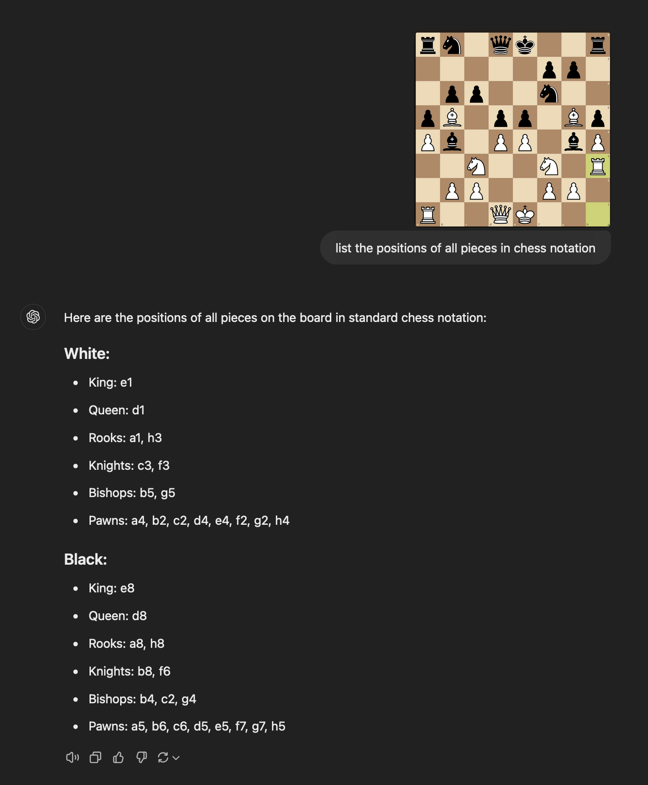
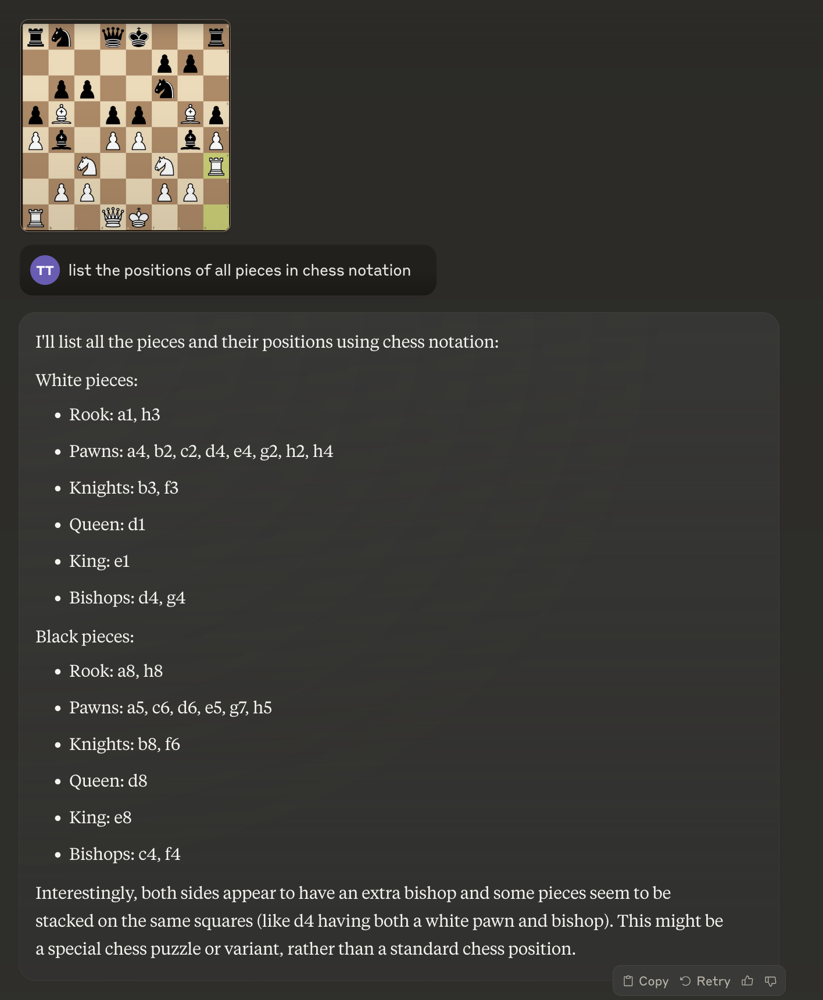

# Can Frontier Models See a Chessboard?

Can SOTA models see the pieces on a chessboard? Seems like basic object detection. But they can't! This suggests something has gone really wrong with vision. Perhaps the benchmarks that labs claim to be acing do not measure the right things.

